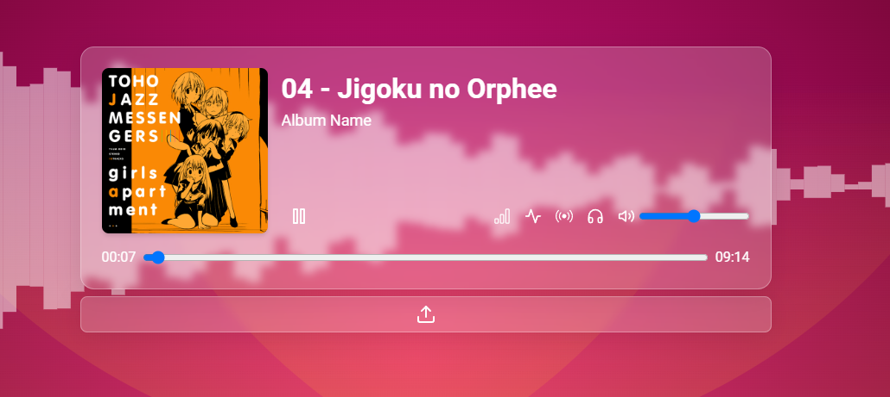
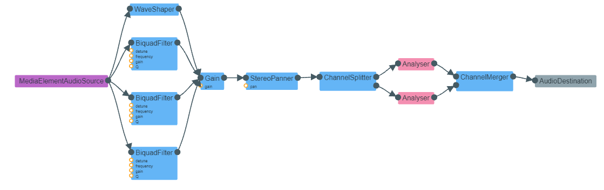

# React Audio Player & Visualizer
Web audio player made with React with the ability to apply audio effects and visualizer.

A mini project to learn Web Audio API in react.

Project can be accessed [here.](https://react-audio-visualizer.vercel.app/)

## Filters/Effects
- Gain
- Distortion
- Stereo Pan
- Bass 
- Mid
- Treble
- Visualiser(bar & line)

## Preview

## Audio Node Setup

## Running The Project
- The usual react vite stuff
